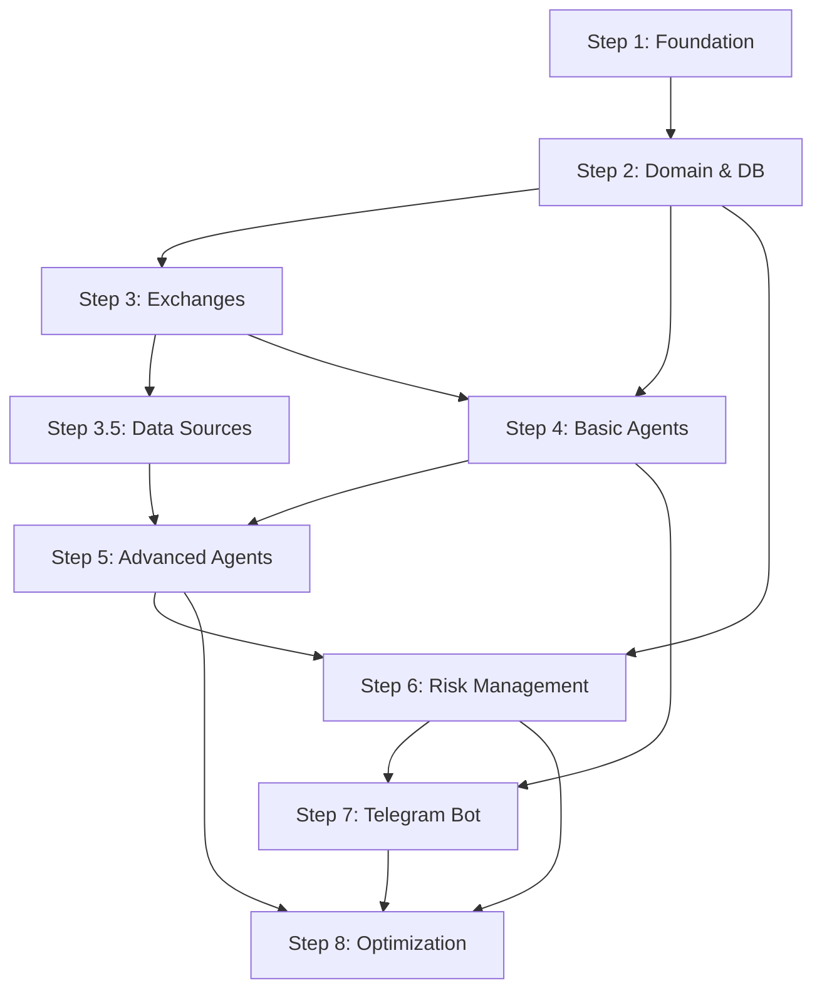

<!-- @format -->

# Prometheus Trading System — Development Roadmap

## Overview

Пошаговый план разработки автономной мульти-агентной торговой системы.

Полная спецификация: [specs.md](specs.md)

---

## Development Phases

### 📦 [Step 1: Foundation & Infrastructure](step-1-foundation.md)

**Время**: 3-5 дней

Базовая инфраструктура проекта:

- ✅ Project structure
- ✅ Configuration system (envconfig + dotenv)
- ✅ Logger (Zap)
- ✅ PostgreSQL connection (sqlx)
- ✅ ClickHouse connection
- ✅ Redis connection
- ✅ Docker Compose setup
- ✅ Makefile

**Результат**: Работающее приложение с подключенными БД

---

### 🗄️ [Step 2: Core Domain & Database](step-2-domain-database.md)

**Время**: 4-6 дней

Доменная модель и database layer:

- ✅ Domain entities (User, ExchangeAccount, TradingPair, Order, Position, Memory)
- ✅ Repository interfaces
- ✅ PostgreSQL migrations
- ✅ Repository implementations (sqlx)
- ✅ Encryption utility (AES-256-GCM)
- ✅ Migration runner

**Результат**: Полная database schema, работающие repositories

---

### 📊 [Step 3: Exchange Integration & Market Data](step-3-exchange-integration.md)

**Время**: 5-7 дней

Интеграция с биржами и сбор market data:

- ✅ Exchange interface
- ✅ Binance client (spot + futures)
- ✅ Bybit client (spot + futures)
- ✅ Exchange factory
- ✅ ClickHouse schemas (OHLCV, tickers, orderbook)
- ✅ Market data repository
- ✅ OHLCV collector worker
- ✅ Worker scheduler

**Результат**: Real-time market data в ClickHouse

---

### 📰 [Step 3.5: External Data Sources](step-3.5-datasources.md)

**Время**: 7-10 дней

Интеграция внешних источников данных:

- ✅ **News sources**: CoinDesk, CoinTelegraph, The Block
- ✅ **Sentiment sources**: LunarCrush, Santiment, Twitter, Reddit
- ✅ **On-chain sources**: Glassnode (whale movements, exchange flows, MVRV, SOPR)
- ✅ **Derivatives sources**: Deribit, Laevitas (options OI, max pain, gamma)
- ✅ **Liquidations sources**: Coinglass, Hyblock (real-time liquidations, heatmaps)
- ✅ **Macro sources**: Investing.com, FRED (economic calendar, Fed rates)
- ✅ Workers для каждого источника
- ✅ ClickHouse schemas для всех типов данных

**Результат**: Агенты получают доступ к новостям, sentiment, on-chain, derivatives данным

---

### 🤖 [Step 4: Basic Agent System](step-4-basic-agents.md)

**Время**: 7-10 дней

Базовая агентная система:

- ✅ AI provider registry (Claude, OpenAI, DeepSeek, Gemini)
- ✅ Claude provider implementation
- ✅ Template system (prompt loading)
- ✅ Tools registry
- ✅ Basic tools (get_price, rsi, macd)
- ✅ Agent factory
- ✅ First agents (Market Analyst, Risk Manager, Executor)
- ✅ Chain-of-Thought prompts

**Результат**: 3-4 работающих агента с CoT reasoning

---

### 🧠 [Step 5: Advanced Agents & Tools](step-5-advanced-agents.md)

**Время**: 10-14 дней

Полная агентная экосистема:

- ✅ 14 специализированных агентов
- ✅ 80+ tools в 9 категориях:
  - Market tools (price, OHLCV, orderbook)
  - Technical indicators (RSI, MACD, Bollinger, etc.)
  - SMC tools (FVG, Order Blocks, liquidity zones)
  - Sentiment tools (news, social, Fear&Greed)
  - On-chain tools (whale movements, exchange flows)
  - Macro tools (economic calendar, Fed rates)
  - Derivatives tools (options OI, gamma exposure)
  - Trading tools (place orders, manage positions)
  - Risk tools (circuit breaker, validation)
- ✅ Parallel/Sequential workflows
- ✅ Memory system (personal + collective)
- ✅ Reasoning logger (CoT tracking)

**Результат**: Полная агентная система со всеми инструментами

---

### 🛡️ [Step 6: Risk Management & Safety](step-6-risk-management.md)

**Время**: 5-7 дней

Система защиты и риск-менеджмента:

- ✅ Risk Engine (circuit breaker)
- ✅ Kill switch (emergency shutdown)
- ✅ Position monitoring worker
- ✅ Risk state tracking
- ✅ Trade journal
- ✅ Strategy evaluator
- ✅ Daily reports
- ✅ Risk tools for agents

**Результат**: Безопасная торговля с автоматическими стопами

---

### 📱 [Step 7: Telegram Bot & User Interface](step-7-telegram-bot.md)

**Время**: 5-7 дней

Telegram-first пользовательский интерфейс:

- ✅ Telegram bot framework
- ✅ Command handlers
- ✅ Bot commands:
  - `/start`, `/help`, `/connect`, `/disconnect`
  - `/open_position`, `/close_position`, `/positions`
  - `/balance`, `/stats`, `/pnl`
  - `/settings`, `/pause`, `/resume`, `/report`
- ✅ Notifications (trade opened/closed, risk alerts)
- ✅ Kafka consumer for notifications
- ✅ Template system для сообщений

**Результат**: Полное управление системой через Telegram

---

### ⚡ [Step 8: Advanced Features & Optimization](step-8-advanced-features.md)

**Время**: 7-10 дней

Production optimizations:

- ✅ ClickHouse batch writer
- ✅ Redis caching layer
- ✅ Kafka producer/consumer
- ✅ Batch order executor
- ✅ Graceful shutdown manager
- ✅ Prometheus metrics
- ✅ Unit tests
- ✅ Integration tests
- ✅ Performance optimization
- ✅ Production Dockerfile
- ✅ Deployment guide

**Результат**: Production-ready система

---

## Timeline Summary

| Phase    | Duration | Cumulative | Key Deliverable                     |
| -------- | -------- | ---------- | ----------------------------------- |
| Step 1   | 3-5d     | Week 1     | Infrastructure setup                |
| Step 2   | 4-6d     | Week 1-2   | Database & domain model             |
| Step 3   | 5-7d     | Week 2-3   | Exchange integration                |
| Step 3.5 | 7-10d    | Week 3-4   | External data sources               |
| Step 4   | 7-10d    | Week 4-6   | Basic agent system                  |
| Step 5   | 10-14d   | Week 6-8   | Advanced agents & tools             |
| Step 6   | 5-7d     | Week 8-9   | Risk management                     |
| Step 7   | 5-7d     | Week 9-10  | Telegram bot                        |
| Step 8   | 7-10d    | Week 10-12 | Optimization & production readiness |

**Total**: 10-12 недель (2.5-3 месяца) до production

---

## Architecture Layers

```
┌─────────────────────────────────────────────────────────────┐
│                     USER INTERFACE                          │
│                   Telegram Bot (Step 7)                     │
└─────────────────────────────────────────────────────────────┘
                            ▲
                            │
┌─────────────────────────────────────────────────────────────┐
│                    AGENT ORCHESTRATION                      │
│         14 Specialized Agents (Steps 4-5)                   │
│  Market│SMC│Sentiment│OnChain│Correlation│Macro│Derivatives│
│           Strategy Planner│Risk Manager│Executor            │
└─────────────────────────────────────────────────────────────┘
                            ▲
                            │
┌─────────────────────────────────────────────────────────────┐
│                    TOOLS LAYER (80+)                        │
│  Market│Indicators│SMC│Sentiment│OnChain│Macro│Derivatives │
│              Trading│Risk│Memory│Evaluation                 │
└─────────────────────────────────────────────────────────────┘
                            ▲
                            │
┌─────────────────────────────────────────────────────────────┐
│                    DATA LAYER                               │
│  ┌──────────┐  ┌──────────┐  ┌──────────┐  ┌──────────┐   │
│  │Exchanges │  │Data      │  │AI        │  │Risk      │   │
│  │(Step 3)  │  │Sources   │  │Providers │  │Engine    │   │
│  │          │  │(Step 3.5)│  │(Step 4)  │  │(Step 6)  │   │
│  └──────────┘  └──────────┘  └──────────┘  └──────────┘   │
└─────────────────────────────────────────────────────────────┘
                            ▲
                            │
┌─────────────────────────────────────────────────────────────┐
│                   INFRASTRUCTURE                            │
│  PostgreSQL│ClickHouse│Redis│Kafka (Steps 1-2)             │
└─────────────────────────────────────────────────────────────┘
```

---

## Key Components by Step

### Step 1: Foundation

- Config, Logger, DB Connections, Docker

### Step 2: Domain & DB

- Entities, Repositories, Migrations, Encryption

### Step 3: Exchanges

- Binance, Bybit, Market Data, Workers

### Step 3.5: Data Sources ⭐ (НОВОЕ!)

- News, Sentiment, On-Chain, Derivatives, Liquidations, Macro

### Step 4: Basic Agents

- AI Providers, Templates, Tools Registry, First 3 Agents

### Step 5: Advanced Agents

- All 14 Agents, 80+ Tools, Workflows, Memory System

### Step 6: Risk Management

- Circuit Breaker, Kill Switch, Position Monitor, Journal

### Step 7: Telegram

- Bot Commands, Handlers, Notifications, User Interface

### Step 8: Optimization

- Batching, Caching, Kafka, Testing, Production Deploy

---

## Critical Path

**Минимально жизнеспособный продукт (MVP):**

1. **Step 1** → Infrastructure ✅
2. **Step 2** → Database ✅
3. **Step 3** → Exchanges (только Binance spot) ✅
4. **Step 3.5** → News + Fear&Greed только ⚠️
5. **Step 4** → 3 базовых агента (Market Analyst, Risk, Executor) ✅
6. **Step 6** → Circuit breaker ✅
7. **Step 7** → Basic Telegram commands ✅

**MVP Timeline**: 6-8 недель

**Full System**: 10-12 недель

---

## Development Best Practices

### 1. Test After Each Step

```bash
# После каждого step:
make docker-up
make dev
# Проверить что всё работает
```

### 2. Commit After Each Step

```bash
git add .
git commit -m "feat: completed step X - description"
git tag step-X
```

### 3. Use Testnet First

- Все биржевые интеграции сначала на testnet
- Только после тестирования переходить на mainnet

### 4. Start Small

- Начните с BTC/USDT только
- Добавляйте другие пары постепенно
- Малые бюджеты ($10-50) для тестов

### 5. Monitor Everything

- Логи в production
- Метрики в Prometheus
- Алерты в Telegram
- Ошибки в Sentry

---

## Dependencies Between Steps



**Параллельные треки:**

- Steps 3 и 3.5 можно делать параллельно
- Steps 4 и 6 частично параллельны
- Step 7 можно начать после Step 4

---

## Resource Requirements

### Development Machine

- CPU: 4+ cores
- RAM: 16GB+
- Disk: 50GB+ SSD
- OS: macOS/Linux/Windows with Docker

### Production Server (Minimum)

- CPU: 8 cores
- RAM: 32GB
- Disk: 500GB SSD
- Network: 1Gbps
- OS: Ubuntu 22.04 LTS

### External Services

- PostgreSQL 16 (managed or self-hosted)
- ClickHouse 24.1+ (managed or self-hosted)
- Redis 7+ (managed or ElastiCache)
- Kafka 3.6+ (managed or self-hosted)

### API Keys Needed

**Required for MVP:**

- Telegram Bot Token (free)
- Claude API Key ($20-100/month)
- Binance API Key (free, for trading needs account)

**Optional (for full system):**

- LunarCrush API ($49-299/month)
- Glassnode API ($29-799/month)
- Coinglass API ($free-99/month)
- Deribit API (free)
- OpenAI API (alternative to Claude)

**Estimated Monthly Cost**: $100-500 (depending on trading volume and data sources)

---

## Success Metrics

### After Each Step

**Step 1**: Все 3 БД подключены ✅  
**Step 2**: Тестовый user создан в БД ✅  
**Step 3**: Market data поступает в ClickHouse ✅  
**Step 3.5**: News и sentiment данные собираются ✅  
**Step 4**: Первый агент может вызывать tools ✅  
**Step 5**: Pipeline из агентов работает ✅  
**Step 6**: Circuit breaker срабатывает при drawdown ✅  
**Step 7**: Можно открыть позицию через /open_position ✅  
**Step 8**: System handles 100+ concurrent users ✅

### After MVP (Steps 1-4 + 6-7 basic)

- [ ] User can connect exchange via Telegram
- [ ] User can open position with budget
- [ ] Market Analyst analyzes BTC and gives signal
- [ ] Risk Manager validates trade
- [ ] Executor places order on exchange
- [ ] User receives notification
- [ ] Circuit breaker stops trading on drawdown
- [ ] System runs 24/7 without crashes

### After Full System (All Steps)

- [ ] All 14 agents working
- [ ] All 80+ tools functional
- [ ] News/Sentiment/OnChain data integrated
- [ ] Memory system stores learnings
- [ ] Self-evaluation improves strategies
- [ ] Multi-user system stable
- [ ] Win rate > 50%
- [ ] Uptime > 99.5%

---

## Common Issues & Solutions

### Issue: AI API rate limits

**Solution**: Use multiple providers, implement retry logic, cache results

### Issue: Exchange API rate limits

**Solution**: Use WebSocket for real-time data, batch requests, add delays

### Issue: High ClickHouse write load

**Solution**: Use batch writer (Step 8), optimize partitions, use materialized views

### Issue: Agent costs too high

**Solution**: Use cheaper models for simple tasks (GPT-4 → GPT-3.5), cache decisions

### Issue: Circuit breaker triggers too often

**Solution**: Adjust thresholds in user settings, improve strategy quality

---

## After Launch

### Month 1: Stabilization

- Monitor errors
- Fix bugs
- Optimize performance
- Gather user feedback

### Month 2-3: Improvements

- Add more exchanges (OKX, Kucoin)
- Add more tools
- Improve agent prompts
- Add backtesting

### Month 4+: Scale

- Web dashboard
- Mobile app
- Strategy marketplace
- ML integration (market regime detection)

---

## Support & Resources

### Documentation

- [Complete Specification](specs.md) - Полная техническая спецификация
- [Step-by-step Guides](step-1-foundation.md) - Пошаговые инструкции
- API Documentation - После Step 8

### Community

- GitHub Issues - Bug reports
- Telegram Channel - Announcements
- Discord - Developer community

### Contacts

- Email: support@prometheus-trading.com
- Telegram: @prometheus_support

---

## License

MIT License - см. LICENSE файл

---

**Good luck building your autonomous trading system! 🚀**

_If you follow all steps carefully, you'll have a production-ready AI trading system in 10-12 weeks._
