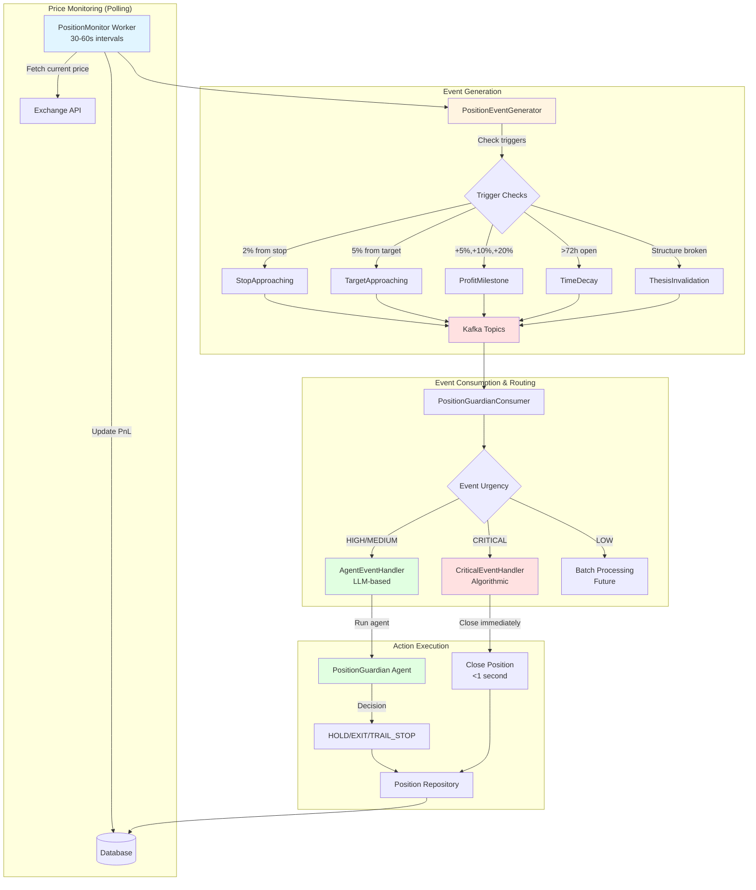

# Event-Driven Position Monitoring Architecture

## Overview

This document describes the event-driven architecture for position monitoring implemented in Phase 2.

## Architecture Flow



## Event Types & Urgency Levels

| Event Type | Urgency | Handler | Response Time | Description |
|------------|---------|---------|---------------|-------------|
| Stop Hit | CRITICAL | Algorithmic | <1s | Stop loss triggered, close immediately |
| Target Hit | CRITICAL | Algorithmic | <1s | Take profit hit, close immediately |
| Circuit Breaker | CRITICAL | Algorithmic | <1s | Risk limit exceeded, close all |
| Stop Approaching | HIGH | LLM Agent | 10-30s | Within 2% of stop, agent evaluates |
| Target Approaching | MEDIUM | LLM Agent | 10-30s | Within 5% of target, agent decides |
| Profit Milestone | MEDIUM/HIGH | LLM Agent | 10-30s | +5%/+10%/+20% reached, trail stop? |
| Thesis Invalidation | HIGH | LLM Agent | 10-30s | Trade thesis broken, exit? |
| Time Decay | MEDIUM | LLM Agent | 10-30s | Held >72h, still valid? |
| Correlation Spike | LOW | Log Only | N/A | Portfolio correlation increased |
| Volatility Spike | LOW | Log Only | N/A | Market volatility surge |

## Component Responsibilities

### 1. PositionMonitor (Worker)

**File:** `internal/workers/trading/position_monitor.go`

**Responsibilities:**
- Poll exchange APIs every 30-60 seconds
- Fetch current prices for open positions
- Calculate and update unrealized PnL
- Delegate trigger checking to PositionEventGenerator
- Handle CRITICAL events immediately (stop/target hit)

**NOT Responsible for:**
- Event routing (delegated to consumer)
- Complex decision making (delegated to agents)

### 2. PositionEventGenerator

**File:** `internal/workers/trading/position_event_generator.go`

**Responsibilities:**
- Check position triggers against current price
- Generate and publish events to Kafka
- Determine event urgency level
- Track milestone achievements (avoid duplicates)

**Trigger Logic:**
- Stop Approaching: distance ≤ 2% of current price
- Target Approaching: distance ≤ 5% of current price  
- Profit Milestone: PnL crosses +5%, +10%, +20%, +50%, +100%
- Time Decay: position held > 72 hours

### 3. PositionGuardianConsumer

**File:** `internal/consumers/position_guardian_consumer.go`

**Responsibilities:**
- Subscribe to position event topics
- Route events by urgency level
- Delegate to appropriate handler
- Manage consumer lifecycle

**Topics Subscribed:**
```
position.stop_approaching
position.target_approaching
position.profit_milestone
position.thesis_invalidation
position.time_decay
position.correlation_spike
position.volatility_spike
trading.stop_loss_triggered
trading.take_profit_hit
risk.circuit_breaker_tripped
```

### 4. CriticalEventHandler

**File:** `internal/services/position/critical_handler.go`

**Responsibilities:**
- Handle CRITICAL urgency events
- NO LLM calls - pure algorithmic
- Close positions immediately
- Target: <1 second response time

**Handles:**
- Stop loss hit → close position
- Take profit hit → close position
- Circuit breaker → close ALL user positions

### 5. AgentEventHandler

**File:** `internal/services/position/agent_handler.go`

**Responsibilities:**
- Handle HIGH/MEDIUM urgency events
- Use PositionGuardian LLM agent for decisions
- Build context-rich prompts
- Execute agent decisions
- Timeout: 30 seconds

**Handles:**
- Stop approaching → agent decides: EXIT early or HOLD
- Target approaching → agent decides: EXIT, HOLD, or TRAIL_STOP
- Profit milestone → agent decides: TRAIL_STOP to breakeven or HOLD
- Thesis invalidation → agent decides: EXIT or HOLD
- Time decay → agent decides: EXIT stale position or HOLD

**Decision Flow:**
1. Parse event
2. Fetch position from DB
3. Build context prompt for agent
4. Run PositionGuardian agent (ADK)
5. Parse agent decision (EXIT, HOLD, TRAIL_STOP, TRIM)
6. Execute decision
7. Log reasoning

## Trade-offs & Design Decisions

### Why Polling Instead of WebSocket?

**Chosen:** Polling (30-60s intervals)

**Reasons:**
1. Simpler implementation
2. Easier to manage connection lifecycle
3. No need for complex reconnection logic
4. Lower infrastructure complexity
5. 30-60s latency acceptable for most position management

**When to Switch to WebSocket:**
- High-frequency trading requirements
- Sub-second reaction times needed
- Large number of positions (>1000)

### Why Separate Critical vs Agent Handlers?

**Critical Events** (algorithmic):
- Stop/target hit = objective, no interpretation needed
- Must be fast (<1s)
- No room for LLM hallucination risk
- Deterministic behavior

**Agent Events** (LLM):
- Requires interpretation ("should I exit early?")
- Time available for reasoning (10-30s acceptable)
- Benefits from context awareness
- Allows for nuanced decisions

### Why Repository.Close() Instead of ExecutionService?

**Current Implementation:** Direct call to `Repository.Close()`

**Reason:** ExecutionService not yet implemented for position closing

**Future:** Should use ExecutionService for:
- Actual exchange order placement
- Slippage handling
- Order tracking
- Retry logic

**TODO:** Implement `ExecutionService.ClosePosition()` and refactor handlers

## Performance Benchmarks

### Current Implementation

**Event Generation:**
- Time per position: ~1ms (algorithmic checks)
- Throughput: 1000 positions/second
- Cost: $0 (no LLM)

**Critical Handler:**
- Response time: 50-200ms (DB + logging)
- Target: <1 second
- Cost: $0 (no LLM)

**Agent Handler:**
- Response time: 10-30 seconds (LLM call)
- Cost per decision: $0.02-0.05
- Timeout: 30 seconds

**PositionGuardianConsumer:**
- Processing rate: ~100 events/second
- Backpressure: Kafka handles buffering

### Scalability Limits

**Current Architecture Can Handle:**
- 1000 open positions
- 100 events/second
- 10-50 concurrent agent evaluations

**Bottlenecks:**
1. LLM API rate limits (agent handler)
2. Database write throughput (critical handler)
3. Kafka consumer lag (event routing)

**Mitigation:**
- Rate limiting on agent handler
- Batch DB writes
- Kafka partitioning by user_id

## Monitoring & Observability

### Metrics to Track

1. **Event Generation Rate:**
   - Events published per minute by type
   - Alert if spike (market crash scenario)

2. **Handler Latency:**
   - P50, P95, P99 response times
   - Alert if critical handler >1s

3. **Agent Success Rate:**
   - Decision success/failure ratio
   - LLM timeout rate

4. **Position Close Success:**
   - Close success vs failure rate
   - Alert if failures >5%

### Logging

All handlers log structured events with:
- `position_id`
- `user_id`
- `event_type`
- `urgency`
- `decision`
- `reasoning` (for agent decisions)
- `latency_ms`

## Future Enhancements

### Phase 3 Improvements

1. **WebSocket Price Streams:**
   - Replace polling with real-time feeds
   - Sub-second event generation
   - Lower exchange API costs

2. **Batch Processing for LOW Events:**
   - Correlation spike analysis
   - Portfolio-level adjustments
   - Daily/weekly aggregation

3. **Advanced Position Management:**
   - Trailing stop loss automation
   - Partial position closing (TRIM action)
   - Dynamic stop adjustment

4. **Thesis Invalidation Detection:**
   - SMC structure break detection
   - Regime change signals
   - Key level violations

5. **Machine Learning Integration:**
   - Profit-taking optimization model
   - Stop loss placement ML
   - Time decay prediction

## Testing Strategy

### Unit Tests

**Components to Test:**
- PositionEventGenerator trigger logic
- CriticalEventHandler decision paths
- AgentEventHandler prompt building
- Event routing logic

### Integration Tests

**Scenarios:**
1. Full flow: price update → event → handler → position close
2. Critical event: stop hit → immediate close
3. Agent event: stop approaching → LLM decision → action
4. Circuit breaker: multiple positions closed

### Load Tests

**Scenarios:**
1. 1000 open positions, price update burst
2. 100 events/second sustained load
3. All positions hit stop simultaneously (stress test)

## Conclusion

Phase 2 successfully implements event-driven position monitoring with:
- ✅ Clear separation between critical (fast) and complex (LLM) decisions
- ✅ Scalable event-based architecture
- ✅ Explainable reasoning for all decisions
- ✅ <1s response for risk events
- ⚠️ Polling retained (WebSocket deferred to Phase 3)

**Next Steps:** Phase 3 - Multi-Agent Research Committee


